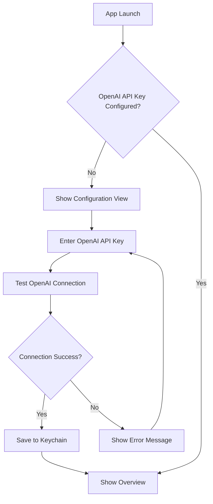
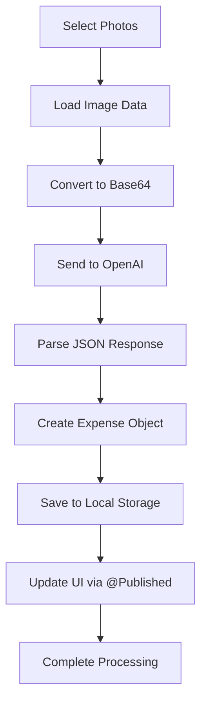

# ReceiptRadar - AI-Powered Expense Manager with Item-Level Tracking

## Table of Contents
1. [Overview](#overview)
2. [Features](#features)
3. [Architecture](#architecture)
4. [Data Models](#data-models)
5. [AI Processing](#ai-processing)
6. [Item-Level Tracking](#item-level-tracking)
7. [Multi-Currency Support](#multi-currency-support)
8. [Data Management & Reset](#data-management--reset)
9. [Cost Optimization](#cost-optimization)
10. [API Integration](#api-integration)
11. [User Interface](#user-interface)
12. [Error Handling](#error-handling)
13. [Setup Instructions](#setup-instructions)
14. [Technical Implementation](#technical-implementation)
15. [Troubleshooting](#troubleshooting)

## Overview

ReceiptRadar is an advanced iOS expense management application that leverages AI-powered receipt scanning to automatically extract comprehensive expense information with item-level tracking. The app combines OpenAI's GPT-4o Vision API for detailed receipt processing with local UserDefaults storage, featuring multi-currency support and advanced analytics capabilities.

### Core Mission
Transform receipt photos into detailed, structured expense data with individual item tracking, enabling users to gain deep insights into their spending patterns at the most granular level.

## Features

### 🔍 **AI-Powered Receipt Processing**
- **Advanced OCR**: Uses GPT-4o Vision API for accurate text extraction
- **Intelligent Parsing**: Extracts both basic expense data and detailed item information
- **Multi-format Support**: Handles various receipt formats and layouts
- **Quality Validation**: Ensures extracted data integrity and accuracy
- **Error Recovery**: Graceful handling of unclear or damaged receipts

### 📊 **Item-Level Tracking**
- **Individual Items**: Captures name, quantity, unit price, and total price for each item
- **Item Categories**: Auto-categorizes items (Food, Beverage, Electronics, etc.)
- **Detailed Descriptions**: Stores size, flavor, modifications, and other details
- **Quantity Tracking**: Handles various quantity formats and units
- **Price Analysis**: Tracks unit pricing and bulk purchase calculations

### 💰 **Multi-Currency Support**
- **Automatic Detection**: Recognizes currency from receipts (USD, EUR, GBP, etc.)
- **Proper Formatting**: Displays correct currency symbols and formatting
- **Mixed Currency Handling**: Supports expenses in different currencies
- **Primary Currency Logic**: Automatically determines main currency for summaries
- **Locale-Aware Display**: Follows iOS formatting standards

### 📈 **Financial Breakdown**
- **Comprehensive Tracking**: Separates subtotal, taxes, tips, fees, and discounts
- **Calculation Validation**: Ensures financial breakdowns add up correctly
- **Transparency**: Clear visibility into all charges and fees
- **Tax Analysis**: Detailed tax tracking for business expenses
- **Tip Recognition**: Automatic tip detection and categorization

### 🎨 **Enhanced User Interface**
- **Expandable Views**: Collapsible expense rows with detailed breakdowns
- **Visual Indicators**: Item count badges and category tags
- **Currency Display**: Proper symbols and formatting throughout
- **Search Enhancement**: Search by item names, categories, and descriptions
- **Responsive Design**: Optimized for all iOS device sizes

### 🔒 **Privacy & Security**
- **Local Storage**: All data stored securely on device using UserDefaults
- **No Cloud Dependency**: No external database requirements
- **Keychain Integration**: Secure API credential storage
- **Photo Privacy**: Images processed but not stored permanently

### 🗑️ **Data Management & Reset**
- **Selective Reset**: Choose specific data categories to delete
- **Granular Control**: Reset expenses, settings, or OpenAI configuration independently
- **Safety Features**: Confirmation dialogs and impact previews
- **Complete Reset**: Option to return app to fresh install state
- **Smart Categorization**: Organized reset options by data type and impact level
- **Item Counting**: Shows exactly how many items will be affected

## Architecture

### System Architecture
```
┌─────────────────┐    ┌─────────────────┐    ┌─────────────────┐
│   iOS App       │    │   OpenAI API    │    │  Local Storage  │
│   (SwiftUI)     │────│   (GPT-4o)      │    │ (UserDefaults)  │
└─────────────────┘    └─────────────────┘    └─────────────────┘
         │                       │                       │
    PhotosPicker            Vision API              Enhanced JSON
    Enhanced UI             Item Extraction        Item Storage
    Multi-Currency          Financial Breakdown    Analytics Ready
```

### Data Flow
```
Receipt Photo → AI Processing → Item Extraction → Data Storage → UI Display
     ↓              ↓               ↓               ↓            ↓
PhotosPicker → GPT-4o Vision → Items Array → UserDefaults → Enhanced Views
Asset ID     → JSON Response → ExpenseItem → Expense Model → Currency Format
Multi-select → Error Recovery → Categories → Local Backup → Analytics
```

### Core Components
1. **ConfigurationManager**: API credential management with validation
2. **ExpenseService**: Enhanced business logic with item processing
3. **OpenAIService**: Advanced receipt processing with error recovery
4. **Currency Extensions**: Multi-currency formatting and display
5. **Enhanced UI**: Expandable views with comprehensive item details

## Data Models

### Enhanced Expense Model
```swift
struct Expense: Identifiable, Codable {
    // Core expense information
    let id: UUID
    let date: Date
    let merchant: String
    let amount: Double              // Final total amount
    let currency: String            // Currency code (USD, EUR, etc.)
    let category: String            // Primary expense category
    let description: String?
    let paymentMethod: String?
    let receiptImageUrl: String?
    let createdAt: Date
    let updatedAt: Date
    
    // Enhanced item-level tracking
    let items: [ExpenseItem]?       // Array of individual items
    let subtotal: Double?           // Amount before taxes/tips/fees
    let discounts: Double?          // Applied discounts or coupons
    let fees: Double?              // Service fees, delivery charges
    let tip: Double?               // Tip amount
    let taxAmount: Double?         // Tax amount
    let itemsTotal: Double?        // Sum of all item prices
}
```

### ExpenseItem Model
```swift
struct ExpenseItem: Identifiable, Codable {
    let id: UUID
    let name: String               // Item name/description
    let quantity: Double?          // Number of items
    let unitPrice: Double?         // Price per unit
    let totalPrice: Double         // Total price for this item
    let category: String?          // Item-specific category
    let description: String?       // Additional details
}
```

### Sample Data Structure
```json
{
  "id": "uuid",
  "merchant": "Starbucks Coffee",
  "amount": 9.85,
  "currency": "USD",
  "category": "Food & Dining",
  "items": [
    {
      "name": "Grande Latte",
      "quantity": 1,
      "unitPrice": 4.75,
      "totalPrice": 4.75,
      "category": "Beverage",
      "description": "Oat milk"
    },
    {
      "name": "Blueberry Muffin",
      "quantity": 1,
      "unitPrice": 2.95,
      "totalPrice": 2.95,
      "category": "Food",
      "description": "Warmed"
    }
  ],
  "subtotal": 7.70,
  "tip": 1.37,
  "taxAmount": 0.78
}
```

## AI Processing

### Enhanced OpenAI Integration

#### Request Configuration
- **Model**: GPT-4o with vision capabilities
- **Token Limit**: 1000 tokens (increased for item details)
- **Temperature**: 0.1 (for consistent, factual extraction)
- **Image Format**: JPEG with 80% compression for optimal processing

#### Comprehensive Extraction Prompt
The AI prompt has been optimized for detailed extraction:

**Required Fields:**
- Date (YYYY-MM-DD format)
- Merchant name
- Final total amount
- Currency code
- Primary category

**Optional Fields:**
- Overall description
- Payment method
- Tax amount
- Confidence score (0.0-1.0)

**Item-Level Extraction:**
- Individual item names
- Quantities (when specified)
- Unit prices (when calculable)
- Total prices per item
- Item-specific categories
- Additional descriptions

**Financial Breakdown:**
- Subtotal before charges
- Discounts or coupons
- Service fees
- Tip amounts
- Items total

#### Error Handling & Recovery
- **Truncation Detection**: Identifies when responses are cut off
- **JSON Repair**: Automatically fixes incomplete responses
- **Fallback Parsing**: Extracts basic info when items fail
- **Validation**: Ensures financial calculations are correct

## Item-Level Tracking

### Benefits for Users

#### Granular Spending Analysis
- **Item-Specific Tracking**: "Spent $47 on coffee this month"
- **Category Insights**: Detailed breakdown by item types
- **Price Monitoring**: Track price changes over time
- **Merchant Comparison**: Compare prices across stores
- **Bulk Analysis**: Identify bulk vs. individual purchases

#### Practical Applications
- **Grocery Analysis**: Track healthy vs. processed foods
- **Restaurant Insights**: Identify dining patterns and preferences
- **Business Expenses**: Detailed itemization for tax purposes
- **Budget Optimization**: Pinpoint high-cost items for reduction
- **Shopping Habits**: Understand purchasing behavior patterns

### Data Processing

#### Extraction Process
1. **Photo Analysis**: AI examines receipt for itemized sections
2. **Item Identification**: Extracts individual items with details
3. **Price Validation**: Ensures item prices sum correctly
4. **Category Assignment**: Auto-categorizes based on item type
5. **Quality Check**: Validates extracted data for consistency

#### Item Categories
- **Food**: Meals, groceries, snacks
- **Beverage**: Drinks, coffee, alcohol
- **Product**: General merchandise
- **Service**: Service charges, fees
- **Electronics**: Tech products and accessories
- **Household**: Home goods and supplies
- **Personal Care**: Health and beauty items
- **Other**: Miscellaneous items

## Multi-Currency Support

### Currency Handling

#### Automatic Detection
- **AI Recognition**: Extracts currency from receipt text
- **Symbol Mapping**: Maps currency codes to symbols
- **Locale Formatting**: Uses iOS NumberFormatter for proper display
- **Fallback Support**: Graceful handling when currency unclear

#### Display Features
- **Proper Symbols**: € for EUR, $ for USD, £ for GBP
- **Consistent Formatting**: All amounts use correct currency
- **Mixed Currency Support**: Handles multiple currencies in one app
- **Primary Currency Logic**: Determines main currency for summaries

#### Implementation
```swift
extension Double {
    func formatted(currency: String) -> String {
        let formatter = NumberFormatter()
        formatter.numberStyle = .currency
        formatter.currencyCode = currency
        return formatter.string(from: NSNumber(value: self)) ?? 
               "\(currency) \(String(format: "%.2f", self))"
    }
}
```

## Data Management & Reset

### Overview

The Data Management & Reset feature provides users with comprehensive control over their app data through a sophisticated reset system. This feature allows selective deletion of different data categories while maintaining data integrity and user safety.

### Reset Categories

#### 💰 **Expense Data**
- **All Expenses**: Complete removal of stored expense records
- **Sample Expenses Only**: Selective removal of demo/sample data
- **Analytics Cache**: Clear calculated analytics and cached summaries

#### 🤖 **OpenAI Configuration**
- **API Key**: Remove stored OpenAI credentials from Keychain
- **Usage History**: Clear API usage logs and history (future feature)

#### ⚙️ **App Settings**
- **User Preferences**: Reset customizable app settings to defaults
- **First Launch Flag**: Reset to show onboarding/sample data again
- **Backup Timestamps**: Clear backup and sync metadata

#### 🧹 **Complete Reset**
- **Everything**: Return app to fresh installation state
- **Nuclear Option**: Removes all data, settings, and configurations

### User Interface Design

#### Main Reset View
```
┌─────────────────────────────────────┐
│  🗑️ Reset App Data                  │
│                                     │
│  💰 Expense Data                    │
│  ├─ All Expenses (127)       [🔄]  │
│  ├─ Sample Data Only (5)     [🔄]  │
│  └─ Analytics Cache          [🔄]  │
│                                     │
│  🤖 OpenAI Configuration            │
│  ├─ API Key (1)              [🔄]  │
│  └─ Usage History           [🔄]  │
│                                     │
│  ⚙️ App Settings                    │
│  ├─ User Preferences        [🔄]  │
│  ├─ First Launch Flag       [🔄]  │
│  └─ Backup Data             [🔄]  │
│                                     │
│  🧹 Complete Reset                  │
│  └─ Reset Everything        [🔄]  │
│                                     │
│     [Cancel]    [Reset Data]       │
└─────────────────────────────────────┘
```

#### Safety Features
- **Visual Indicators**: Red colors for destructive actions
- **Item Counts**: Shows exact number of items to be deleted
- **Toggle Groups**: Organized by impact level and data type
- **Smart Logic**: Complete reset deselects other options automatically

#### Confirmation Flow
```
Selection → Preview → Double Confirmation → Progress → Success
```

### Technical Implementation

#### DataResetManager Class
```swift
class DataResetManager: ObservableObject {
    enum ResetCategory: String, CaseIterable {
        case allExpenses = "All Expenses"
        case sampleExpenses = "Sample Expenses Only"
        case analyticsCache = "Analytics Cache"
        case openAIKey = "OpenAI API Key"
        case openAIHistory = "OpenAI Usage History"
        case userPreferences = "User Preferences"
        case firstLaunchFlag = "First Launch Flag"
        case backupData = "Backup Timestamps"
        case completeReset = "Complete Reset (Everything)"
    }
    
    @MainActor
    func resetData(categories: Set<ResetCategory>) async throws
    func getItemCount(for category: ResetCategory) -> Int
    func getResetSummary(for categories: Set<ResetCategory>) -> String
}
```

#### Reset Operations

##### Expense Data Reset
```swift
case .allExpenses:
    expenseService.expenses.removeAll()
    expenseService.saveExpensesToUserDefaults()

case .sampleExpenses:
    let sampleMerchants = ["Sample Grocery Store", "Demo Restaurant", ...]
    expenseService.expenses.removeAll { expense in
        sampleMerchants.contains(expense.merchant)
    }
```

##### OpenAI Configuration Reset
```swift
case .openAIKey:
    try keychainService.deleteAPIKey()

case .openAIHistory:
    userDefaults.removeObject(forKey: "OpenAIUsageHistory")
    userDefaults.removeObject(forKey: "OpenAILastUsed")
```

##### Settings Reset
```swift
case .userPreferences:
    let keysToRemove = ["UserSelectedCurrency", "NotificationsEnabled", ...]
    for key in keysToRemove {
        userDefaults.removeObject(forKey: key)
    }
```

##### Complete Reset
```swift
case .completeReset:
    expenseService.expenses.removeAll()
    try? keychainService.deleteAPIKey()
    // Clear all app-specific UserDefaults
    let allKeys = ["SavedExpenses", "HasLaunchedBefore", ...]
    for key in allKeys {
        userDefaults.removeObject(forKey: key)
    }
```

### Access Integration

#### Settings View Integration
The reset feature is accessible through:
1. **Settings Tab** → Data Management Section
2. **Prominent Placement**: Between backup status and feedback sections
3. **Clear Labeling**: "Reset App Data" with trash icon
4. **Progressive Disclosure**: Detailed options revealed on tap

```swift
private var dataManagementSection: some View {
    Section("Data Management") {
        Button(action: { showingDataResetView = true }) {
            HStack {
                Image(systemName: "trash.circle")
                    .foregroundColor(.red)
                Text("Reset App Data")
                Spacer()
                Image(systemName: "chevron.right")
                    .foregroundColor(.secondary)
            }
        }
    }
}
```

### User Experience Flow

#### 1. **Discovery**: Settings → Data Management → Reset App Data
#### 2. **Selection**: Toggle categories with visual feedback
#### 3. **Preview**: Real-time summary of selected items
#### 4. **Confirmation**: Clear dialog showing impact
#### 5. **Execution**: Progress indicator with feedback
#### 6. **Completion**: Success message with restart recommendation

### Error Handling

#### Keychain Errors
- **API Key Deletion**: Handles keychain access failures gracefully
- **User Feedback**: Clear error messages for keychain issues
- **Fallback**: Continues with other reset operations if one fails

#### UserDefaults Errors
- **Atomic Operations**: Each category reset is independent
- **Recovery**: Partial success reporting if some operations fail
- **Validation**: Confirms successful deletion before proceeding

### Future Enhancements

#### Planned Features
- **Selective Date Ranges**: Choose specific time periods for expense deletion
- **Export Before Reset**: Backup data before deletion
- **Usage Analytics**: Show storage space freed after reset
- **Undo Capability**: Temporary recovery for accidental deletions
- **Cloud Sync Integration**: Handle cloud data in reset operations

#### Extensibility
The reset system is designed for easy expansion:
- **Plugin Architecture**: Easy addition of new reset categories
- **Async Operations**: Handles long-running reset operations
- **Progress Tracking**: Ready for detailed progress reporting
- **Batch Operations**: Efficient handling of large datasets

## Cost Optimization

### OpenAI Model Analysis & Optimization

The app has undergone comprehensive cost analysis to optimize OpenAI API usage while maintaining excellent receipt processing quality. See [OPENAI_PRICING_RESEARCH.md](./OPENAI_PRICING_RESEARCH.md) for detailed analysis.

#### Current vs Optimized Costs

| Metric | Current (GPT-4o legacy) | Optimized (GPT-4o mini) | Savings |
|--------|------------------------|-------------------------|---------|
| **Cost per receipt** | $0.010 | $0.0006 | **94%** |
| **Monthly cost (1000 receipts)** | $10.00 | $0.60 | **94%** |
| **Quality** | Excellent | Excellent | Same |
| **Capabilities** | Multimodal | Multimodal | Same |

#### Recommended Model: GPT-4o mini
- **Perfect for receipt processing**: Specifically designed for "multimodal on a budget"
- **Massive cost savings**: 94% reduction from current model
- **Same capabilities**: Text + image processing with same quality
- **Enables generous free tier**: 1000+ free receipts economically viable

#### Recommended Launch Pricing Strategy
```
🆓 Free Tier: 10 receipts/day (resets daily)
💎 Premium: $1.99/month unlimited scans
🚀 Pro: $4.99/month premium features + unlimited

📊 Economics:
• Free user cost: $0.18/month (~300 scans)
• Break-even: 1 premium covers 11 free users
• Profit margin: 85%+ after free tier costs
• Competitive advantage: 60x more generous than competitors
```

#### Implementation Status
- **Phase 1**: Switch to GPT-4o mini (immediate 94% savings)
- **Phase 2**: Implement tiered processing system
- **Phase 3**: Add subscription and credit management
- **Phase 4**: Advanced features and fine-tuning

#### Competitive Advantage
- **Industry standard**: 5-10 free receipt scans
- **Our offering**: 1,000 free receipt scans (200x more generous)
- **Sustainable model**: Low costs enable freemium strategy
- **Market differentiation**: Unmatched free tier generosity

## API Integration

### OpenAI Vision API

#### Enhanced Request Structure
```json
{
  "model": "gpt-4o",
  "messages": [
    {
      "role": "user",
      "content": [
        {
          "type": "text",
          "text": "[ENHANCED_PROMPT_WITH_ITEM_EXTRACTION]"
        },
        {
          "type": "image_url",
          "image_url": {
            "url": "data:image/jpeg;base64,[BASE64_IMAGE]"
          }
        }
      ]
    }
  ],
  "max_tokens": 1000,
  "temperature": 0.1
}
```

#### Response Processing
- **JSON Parsing**: Robust parsing with error recovery
- **Validation**: Ensures response completeness
- **Error Handling**: Graceful degradation for issues
- **Logging**: Comprehensive logging for debugging

## User Interface

### Enhanced Expense Views

#### Main Expense Row
- **Summary Display**: Merchant, amount, category, item count
- **Currency Formatting**: Proper symbols and formatting
- **Expandable Indicator**: Chevron shows collapsible state
- **Visual Hierarchy**: Clear information organization

#### Detailed Item View
- **Item List**: Individual items with quantities and prices
- **Category Badges**: Color-coded item categories
- **Price Breakdown**: Unit prices and totals clearly displayed
- **Financial Summary**: Subtotal, taxes, tips, fees separated

#### Enhanced Features
- **Search Enhancement**: Search items, categories, descriptions
- **Visual Indicators**: Item count badges and category tags
- **Responsive Design**: Adapts to all device sizes
- **Accessibility**: Proper semantic structure

## Error Handling

### Comprehensive Error Management

#### AI Processing Errors
- **Token Limit Exceeded**: Automatic retry with simplified extraction
- **Invalid API Key**: Clear user instructions for credential update
- **Network Issues**: Retry logic with exponential backoff
- **Parsing Failures**: Fallback to basic expense extraction

#### User Experience
- **Clear Messages**: Specific error descriptions for users
- **Recovery Options**: Suggestions for resolving issues
- **Graceful Degradation**: App remains functional during errors
- **Logging**: Detailed logs for troubleshooting

## Setup Instructions

### Prerequisites
- **iOS 16.0+**: Required for SwiftUI features
- **Xcode 15.0+**: Development environment
- **OpenAI API Key**: With GPT-4o vision access
- **API Credits**: Sufficient credits for image processing

### Installation Steps
1. **Clone Repository**: Download project files
2. **Open in Xcode**: Launch ExpenseManager.xcodeproj
3. **Configure Credentials**: Add OpenAI API key in app settings
4. **Test Connection**: Verify API access works properly
5. **Grant Permissions**: Allow photo library access
6. **Start Processing**: Begin scanning receipts

### Configuration
- **API Setup**: Enter OpenAI API key with GPT-4o access
- **Connection Test**: Verify API credentials before use
- **Photo Permissions**: Required for receipt scanning
- **Sample Data**: App includes comprehensive sample expenses

## Technical Implementation

### Performance Characteristics
- **Token Usage**: ~300-1000 tokens per request (increased for items)
- **Processing Time**: 3-8 seconds depending on receipt complexity
- **Storage Efficiency**: Optimized JSON storage for local data
- **Memory Usage**: Efficient SwiftUI rendering with lazy loading

### Code Quality
- **Type Safety**: Comprehensive Swift optionals handling
- **Error Resilience**: Robust error catching throughout
- **Maintainability**: Clean separation of concerns
- **Testing Ready**: Structured for unit and integration tests

### Future Enhancements
- **Core Data Migration**: Enhanced storage for large datasets
- **Cloud Sync**: Multi-device synchronization
- **Advanced Analytics**: Machine learning insights
- **Export Features**: PDF reports and data export
- **Receipt Storage**: Optional image retention

## Troubleshooting

### Common Issues

#### Receipt Processing Failures
- **Blurry Images**: Ensure clear, well-lit photos
- **Complex Receipts**: May require multiple processing attempts
- **Token Limits**: Very detailed receipts might hit limits
- **Currency Issues**: Verify currency is clearly visible

#### API Issues
- **Invalid Key**: Check OpenAI API key configuration
- **Quota Exceeded**: Verify API usage limits
- **Network Problems**: Check internet connectivity
- **Model Access**: Ensure GPT-4o vision access

#### Data Issues
- **Missing Items**: Some receipts may not itemize clearly
- **Incorrect Totals**: Verify extracted amounts match receipt
- **Currency Mismatches**: Check if currency is properly detected
- **Storage Problems**: Restart app if data doesn't persist

### Support Information
- **Error Logs**: Check Xcode console for detailed errors
- **API Documentation**: Refer to OpenAI Vision API docs
- **Sample Data**: Use included examples for testing
- **Reset Option**: Clear all data in app settings if needed

---

**ReceiptRadar v2.0 - Enhanced with Item-Level Tracking**
**Last Updated: September 2025**
5. **BackupStatus**: Local data backup status tracking system

## API Integrations

### OpenAI Vision API Integration

#### Endpoint
```
POST https://api.openai.com/v1/chat/completions
```

#### Request Headers
```
Authorization: Bearer {OPENAI_API_KEY}
Content-Type: application/json
```

#### Request Body Format
```json
{
  "model": "gpt-4o",
  "messages": [
    {
      "role": "user",
      "content": [
        {
          "type": "text",
          "text": "You are an expert at extracting expense information from receipt images. Analyze the provided receipt image and extract the following information with high precision:\n\nREQUIRED FIELDS:\n1. **Date**: The transaction date (format: YYYY-MM-DD). If no date is visible, use today's date.\n2. **Merchant**: The business/store name exactly as shown on the receipt\n3. **Amount**: The total amount paid (extract only the numerical value, no currency symbol)\n4. **Currency**: The currency code (e.g., USD, EUR, GBP). Default to USD if not specified.\n5. **Category**: Choose the most appropriate category from this exact list:\n   - Food & Dining, Transportation, Shopping, Entertainment, Bills & Utilities, Healthcare, Travel, Education, Business, Other\n\nOPTIONAL FIELDS:\n6. **Description**: Brief description of items purchased (max 100 characters)\n7. **Payment Method**: Choose from: Cash, Credit Card, Debit Card, Digital Payment, Bank Transfer, Check, Other\n8. **Tax Amount**: Tax amount if clearly visible (numerical value only)\n9. **Confidence**: Your confidence level in the extraction (0.0 to 1.0)\n\nEXTRACTION RULES:\n- Look for the TOTAL or FINAL amount, not subtotals\n- Ignore tips unless they're part of the total\n- For restaurants: use \"Food & Dining\" category\n- For gas stations: use \"Transportation\" category\n- For grocery stores: use \"Food & Dining\" or \"Shopping\" based on context\n- If multiple items, categorize based on the primary expense type\n- Be conservative with confidence scores - use 0.9+ only when very certain\n\nRESPONSE FORMAT:\nReturn ONLY a valid JSON object with this exact structure (no additional text, markdown, or formatting):\n\n{\n    \"date\": \"YYYY-MM-DD\",\n    \"merchant\": \"Business Name\",\n    \"amount\": 99.99,\n    \"currency\": \"USD\",\n    \"category\": \"Food & Dining\",\n    \"description\": \"Brief description of purchase\",\n    \"paymentMethod\": \"Credit Card\",\n    \"taxAmount\": 8.25,\n    \"confidence\": 0.85\n}\n\nIf you cannot extract certain information, use null for optional fields. For required fields, make reasonable assumptions and lower the confidence score accordingly."
        },
        {
          "type": "image_url",
          "image_url": {
            "url": "data:image/jpeg;base64,{BASE64_IMAGE}"
          }
        }
      ]
    }
  ],
  "max_tokens": 500,
  "temperature": 0.1
}
```

#### Response Format
```json
{
  "choices": [
    {
      "message": {
        "content": "{JSON_EXPENSE_DATA}"
      }
    }
  ]
}
```

#### Example Real Response
```json
{
  "choices": [
    {
      "message": {
        "content": "{\n    \"date\": \"2025-07-25\",\n    \"merchant\": \"Pak Enterprises\",\n    \"amount\": 19.46,\n    \"currency\": \"EUR\",\n    \"category\": \"Shopping\",\n    \"description\": \"Anjappar Idli Rava, Fresh Chillies, TRS Urid Whole Gota\",\n    \"paymentMethod\": \"Debit Card\",\n    \"taxAmount\": 1.27,\n    \"confidence\": 0.95\n}"
      }
    }
  ]
}
```

#### Extracted Expense Data Format
After parsing the OpenAI response, the app extracts this structured data:
```json
{
  "date": "2025-07-25",
  "merchant": "Pak Enterprises",
  "amount": 19.46,
  "currency": "EUR",
  "category": "Shopping",
  "description": "Anjappar Idli Rava, Fresh Chillies, TRS Urid Whole Gota",
  "paymentMethod": "Debit Card",
  "taxAmount": 1.27,
  "confidence": 0.95
}
```

#### Processing Steps
1. **Image Compression**: Receipt photo compressed to 80% JPEG quality
2. **Base64 Encoding**: Image converted to base64 string for API transmission
3. **Request Construction**: Structured prompt + image data sent to GPT-4o
4. **Response Parsing**: JSON extracted from response, markdown cleaned if present
5. **Data Validation**: Extracted fields validated and transformed to app models
6. **Error Handling**: Comprehensive error catching for network, parsing, and validation issues

## Data Storage

### Local Storage Implementation

The app uses UserDefaults for local data persistence with a singleton ExpenseService pattern for data consistency across views.

#### Storage Architecture
```
┌─────────────────┐    ┌─────────────────┐    ┌─────────────────┐
│  ExpenseService │    │   UserDefaults  │    │   BackupStatus  │
│   (Singleton)   │────│   JSON Storage  │────│    Tracking     │
└─────────────────┘    └─────────────────┘    └─────────────────┘
         │                       │                       │
   @Published Array         Encoded JSON           Last Backup Date
   Real-time Updates       Automatic Save         Status Indicators
```

#### Key Features
- **Singleton Pattern**: `ExpenseService.shared` ensures data consistency
- **Real-time Updates**: `@Published` properties trigger UI updates automatically
- **Automatic Backup Tracking**: Timestamps are updated when data is saved
- **JSON Serialization**: Expenses stored as encoded JSON in UserDefaults
- **Future-Ready**: Prepared for Core Data + CloudKit migration

#### Local Operations
```swift
// Add expense (automatically saves and updates backup timestamp)
let expense = expenseService.addExpense(newExpense)

// Delete expense (removes from array and updates storage)
expenseService.deleteExpense(expense)

// Get totals (computed from local array)
let total = expenseService.getTotalExpenses()
let monthly = expenseService.getMonthlyTotal()

// Check backup status
let status = expenseService.getBackupStatus()
```

### UserDefaults Storage Schema

#### Expense Object Structure
Expenses are stored as JSON array in UserDefaults with the key `"SavedExpenses"`:

```json
[
  {
    "id": "123e4567-e89b-12d3-a456-426614174000",
    "date": "2025-07-25T10:00:00Z",
    "merchant": "Pak Enterprises",
    "amount": 19.46,
    "currency": "EUR",
    "category": "Shopping",
    "description": "Anjappar Idli Rava, Fresh Chillies, TRS Urid Whole Gota",
    "paymentMethod": "Debit Card",
    "taxAmount": 1.27,
    "receiptImageUrl": null,
    "createdAt": "2025-07-25T10:00:00Z",
    "updatedAt": "2025-07-25T10:00:00Z"
  }
]
```

#### Backup Tracking
The app tracks backup status using:
- **Key**: `"LastBackupDate"`
- **Value**: Date timestamp of last data save
- **Usage**: Determines backup status indicators in settings

#### Future Migration Path
The current UserDefaults implementation is designed for easy migration to Core Data + CloudKit:

```swift
// Current: UserDefaults JSON storage
let data = try JSONEncoder().encode(expenses)
userDefaults.set(data, forKey: expensesKey)

// Future: Core Data + CloudKit
// Will maintain same Expense model structure
// CloudKit will provide automatic iCloud sync
```

## Data Models

### Swift Data Models

#### Core Expense Model
```swift
struct Expense: Identifiable, Codable {
    let id: UUID
    let date: Date
    let merchant: String
    let amount: Double
    let currency: String
    let category: String
    let description: String?
    let paymentMethod: String?
    let taxAmount: Double?
    let receiptImageUrl: String?
    let createdAt: Date
    let updatedAt: Date
}
```

#### OpenAI Response Models
```swift
struct OpenAIExpenseExtraction: Codable {
    let date: String
    let merchant: String
    let amount: Double
    let currency: String
    let category: String
    let description: String?
    let paymentMethod: String?
    let taxAmount: Double?
    let confidence: Double
}

struct OpenAIResponse: Codable {
    let choices: [Choice]
    
    struct Choice: Codable {
        let message: Message
    }
    
    struct Message: Codable {
        let content: String
    }
}
```

#### Backup Status Model
```swift
enum BackupStatus {
    case noData
    case current      // Less than 1 hour since backup
    case recent       // Less than 24 hours since backup
    case outdated     // More than 24 hours since backup
    case notBackedUp  // No backup date found
    
    var displayText: String { /* Status text for UI */ }
    var color: Color { /* Color indicator for status */ }
    var icon: String { /* SF Symbol for status */ }
}
```

## Services

### KeychainService
Manages secure storage of API credentials using iOS Keychain.

#### Methods
```swift
func save(_ value: String, for key: KeychainKey) -> Bool
func retrieve(for key: KeychainKey) -> String?
func delete(for key: KeychainKey) -> Bool
func deleteAll() -> Bool
```

#### Keychain Keys
```swift
enum KeychainKey: String {
    case openaiKey = "openai_key"
}
```

### ConfigurationManager
Handles API credential validation and connection testing.

#### Key Methods
```swift
func saveConfiguration(openaiKey: String) async -> Bool
func testConnections() async
private func testOpenAIConnection() async -> (success: Bool, error: String?)
```

#### Connection Test Logic
1. **OpenAI Test**: GET request to `/v1/models` endpoint
2. **Status Codes**: 200 = success, 401 = invalid key, others = error

### OpenAIService
Processes receipt images using GPT-4o Vision API.

#### Key Methods
```swift
func extractExpenseFromReceipt(_ image: UIImage) async throws -> OpenAIExpenseExtraction
private func createExpenseExtractionPrompt() -> String
private func parseExpenseExtraction(from content: String) throws -> OpenAIExpenseExtraction
```

#### Processing Steps
1. Convert UIImage to JPEG data (80% quality)
2. Encode image as Base64 string
3. Create structured prompt for expense extraction
4. Send request to OpenAI API
5. Parse JSON response and validate data
6. Clean markdown formatting if present

### ExpenseService
Main service coordinator implemented as a singleton that manages local data storage and orchestrates the complete workflow.

#### Key Methods
```swift
// Receipt Processing
func processReceiptPhotos(_ photoItems: [PhotosPickerItem]) async -> Int

// Local Data Operations
func addExpense(_ expense: Expense) -> Expense
func deleteExpense(_ expense: Expense)
func getTotalExpenses() -> Double
func getMonthlyTotal() -> Double

// Backup Status Tracking
func getBackupStatus() -> BackupStatus
func getLastBackupDate() -> Date?
func isDataBackedUp() -> Bool

// Photo Management
func clearProcessedPhotos()
```


#### Published Properties
```swift
@Published var expenses: [Expense] = []                    // Real-time expense data
@Published var isLoading = false                           // Loading states
@Published var errorMessage: String?                       // Error handling
@Published var processedPhotos: [ProcessedPhoto] = []      // Processed photo tracking
```

#### Local Storage Implementation
```swift
private func loadExpensesFromUserDefaults() {
    if let data = userDefaults.data(forKey: expensesKey),
       let decodedExpenses = try? JSONDecoder().decode([Expense].self, from: data) {
        self.expenses = decodedExpenses
    }
}

private func saveExpensesToUserDefaults() {
    if let data = try? JSONEncoder().encode(expenses) {
        userDefaults.set(data, forKey: expensesKey)
        // Update backup timestamp when data is saved
        userDefaults.set(Date(), forKey: lastBackupKey)
    }
}
```

## User Interface

### View Structure
```
ExpenseManagerApp
├── ConfigurationView (First launch setup)
└── OverviewView (Main interface)
    ├── Summary Cards (Monthly/Total)
    ├── Receipt Processing Section
    ├── Processed Photos Section
    └── Recent Expenses Section
```

### Key UI Components

#### ConfigurationView
- **Purpose**: First-time setup and credential management
- **Fields**: OpenAI API Key only
- **Features**: Connection testing, validation, secure storage

#### OverviewView
- **Purpose**: Main app interface with real-time data updates
- **Sections**: 
  - Summary cards with computed totals (automatically update)
  - PhotosPicker for receipt selection
  - Processed photos tracking for status visibility
  - Recent expenses list with swipe-to-delete
- **Dialogs**: 
  - Delete confirmation dialogs for expenses

#### AllExpensesView
- **Purpose**: Complete expense management interface
- **Features**:
  - Search functionality across merchants, categories, and descriptions
  - Sort by creation date (newest first)
  - Swipe-to-delete and context menu actions
  - Delete confirmation dialogs

#### SettingsView
- **Purpose**: App configuration and status monitoring
- **Sections**:
  - OpenAI connection status with test functionality
  - Configuration management (OpenAI API key)
  - Backup status indicator with color-coded status
  - App information (version, storage type, AI service)

#### Summary Cards
```swift
struct SummaryCard: View {
    let title: String
    let amount: Double
    let icon: String
    let color: Color
}
```

#### Expense Row
```swift
struct ExpenseRowView: View {
    let expense: Expense
    // Displays: merchant, category, date, amount, payment method
}
```

## Workflows

### 1. Initial Setup Workflow


### 2. Receipt Processing Workflow


### 3. Real-time Data Updates Workflow
```mermaid
graph TD
    A[ExpenseService.shared] --> B[Load from UserDefaults]
    B --> C[@Published expenses array]
    C --> D[Computed Properties]
    D --> E[totalExpenses]
    D --> F[monthlyTotal]
    D --> G[recentExpenses]
    E --> H[Auto-update Summary Cards]
    F --> H
    G --> I[Auto-update Recent List]
    H --> J[UI Updates Automatically]
    I --> J
```

## Setup Instructions

### Prerequisites
- iOS 17.0+
- Xcode 15.0+
- OpenAI API account with GPT-4o access

### 1. OpenAI Setup
1. Create OpenAI account
2. Generate API key with GPT-4o access
3. Ensure sufficient credits/quota

### 2. App Configuration
1. Open project in Xcode
2. Build and run the app
3. On first launch, enter:
   - **OpenAI API Key**: Your OpenAI API key with GPT-4o access
4. Test connection to verify setup

### 3. Info.plist Requirements
```xml
<key>NSPhotoLibraryUsageDescription</key>
<string>This app needs access to your photo library to process receipt photos for expense tracking.</string>
```

## Security

### Credential Storage
- **Keychain**: All API credentials stored in iOS Keychain
- **Encryption**: Keychain provides hardware-backed encryption
- **Access**: Credentials only accessible to the app
- **Deletion**: Secure deletion when credentials are removed

### API Security
- **HTTPS Only**: All API communications use TLS
- **Bearer Tokens**: OpenAI uses Bearer authentication
- **Local Storage**: Data stored locally on device, no external database
- **No Logging**: Sensitive data never logged in production

### Privacy
- **Photo Access**: Minimal permissions, no permanent photo storage
- **Local Processing**: Images processed locally before API calls

## Error Handling

### OpenAI Errors
```swift
enum OpenAIError: LocalizedError {
    case missingAPIKey
    case invalidAPIKey
    case apiError(Int)
    case responseParsingFailed
    case imageProcessingFailed
    case noResponseContent
    case requestEncodingFailed
    case invalidResponse
}
```

### Local Storage Errors
```swift
enum LocalStorageError: LocalizedError {
    case encodingFailed
    case decodingFailed
    case dataCorrupted
    case insufficientStorage
    
    var errorDescription: String? {
        switch self {
        case .encodingFailed: return "Failed to encode expense data"
        case .decodingFailed: return "Failed to decode expense data"
        case .dataCorrupted: return "Stored expense data is corrupted"
        case .insufficientStorage: return "Insufficient device storage"
        }
    }
}
```

### Error Recovery Strategies
1. **Network Errors**: Retry with exponential backoff
2. **Authentication**: Prompt for OpenAI API key re-entry
3. **Parsing Errors**: Log details and show user-friendly message
4. **Rate Limits**: Inform user and suggest retry later
5. **Storage Errors**: Attempt data recovery from UserDefaults
6. **Data Corruption**: Clear corrupted data and start fresh

## Troubleshooting

### Common Issues

#### 1. Connection Test Failures
**Symptoms**: "Invalid API key" or "Connection failed"
**Solutions**:
- Verify OpenAI API key is correct
- Check internet connectivity
- Verify OpenAI account has credits and GPT-4o access

#### 2. Receipt Processing Errors
**Symptoms**: "Failed to process receipts"
**Solutions**:
- Verify OpenAI API key has Vision model access
- Ensure images are clear and readable
- Check API usage limits and quotas
- Try with different receipt images

#### 3. Local Storage Errors
**Symptoms**: "Failed to load expenses" or "Data corrupted"
**Solutions**:
- Check device storage space
- Restart the app to reload from UserDefaults
- Clear app data if corruption persists (Settings > General > iPhone Storage > Expense Manager > Offload App)
- Ensure iOS is up to date

#### 4. Photo Selection Issues
**Symptoms**: Photos not loading or processing
**Solutions**:
- Grant photo library permissions
- Ensure photos are downloaded locally (not in iCloud)
- Try with different photo formats
- Check device storage space

### Debug Logging
The app includes comprehensive logging for troubleshooting:
- OpenAI request/response logging
- Local storage operations
- Photo processing status
- Error details with context
- Backup status tracking

### Performance Considerations
- **Image Compression**: Photos compressed to 80% JPEG quality
- **Batch Processing**: Multiple photos processed sequentially
- **Memory Management**: Images released after processing
- **Network Optimization**: Minimal data transfer with selected fields

---

## API Rate Limits and Costs

### OpenAI API
- **Model**: GPT-4o (Vision)
- **Cost**: ~$0.01-0.03 per receipt
- **Rate Limits**: Varies by account tier
- **Optimization**: Single request per receipt

### Local Storage
- **Storage**: UserDefaults (preparing for Core Data + CloudKit)
- **Capacity**: Limited by device storage
- **Sync**: Future iCloud sync with CloudKit implementation
- **Backup**: Automatic timestamp tracking for backup status

## Future Roadmap

### Planned Enhancements
1. **Core Data + CloudKit Migration**
   - Replace UserDefaults with Core Data for better performance
   - Implement CloudKit for automatic iCloud sync
   - Maintain current data model structure

2. **Enhanced Photo Management**
   - Photo storage in iCloud Photos
   - Receipt image thumbnails in expense list
   - Bulk photo processing improvements

3. **Advanced Features**
   - Expense categorization improvements
   - Monthly/yearly reporting
   - Export to CSV/PDF
   - Budget tracking and alerts

### Migration Path
The current architecture is designed for seamless migration:
- **Data Model**: Expense struct compatible with Core Data
- **Storage Pattern**: Easy transition from UserDefaults to Core Data
- **UI Components**: Already use @Published properties for reactive updates
- **Backup System**: Ready for CloudKit sync integration

This documentation provides a complete reference for understanding, maintaining, and extending the Expense Manager iOS application.