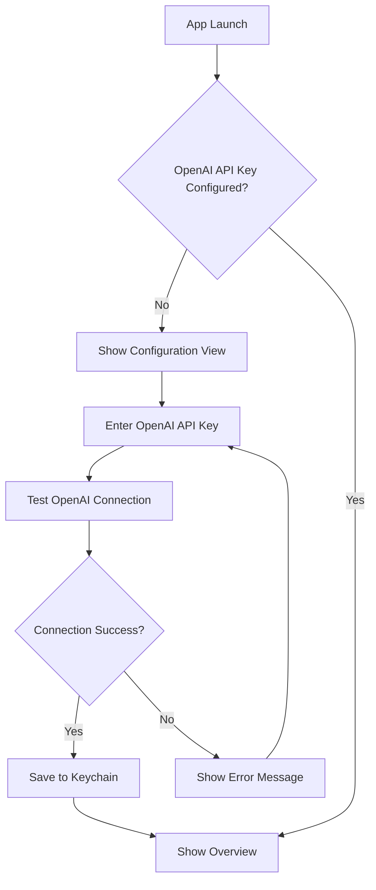
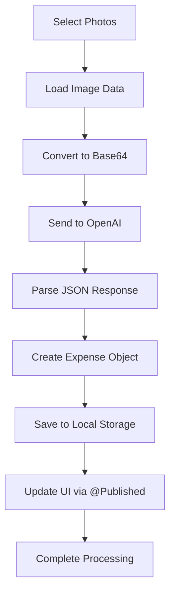

# Expense Manager iOS App - Complete Documentation

## Table of Contents
1. [Overview](#overview)
2. [Architecture](#architecture)
3. [API Integrations](#api-integrations)
4. [Data Storage](#data-storage)
5. [Data Models](#data-models)
6. [Services](#services)
7. [User Interface](#user-interface)
8. [Workflows](#workflows)
9. [Setup Instructions](#setup-instructions)
10. [Security](#security)
11. [Error Handling](#error-handling)
12. [Troubleshooting](#troubleshooting)

## Overview

The Expense Manager is an iOS application that uses AI-powered receipt scanning to automatically extract expense information and store it locally on the device. The app combines OpenAI's Vision API for receipt processing with local UserDefaults storage, with preparation for future Core Data + CloudKit migration for iCloud sync.

### Key Features
- **AI Receipt Processing**: Automatically extracts expense data from receipt photos
- **Secure Configuration**: Encrypted storage of API credentials using iOS Keychain
- **Local Storage**: Fast, reliable local data storage with UserDefaults
- **Real-time Updates**: Instant UI updates when data changes
- **Modern UI**: SwiftUI-based interface with loading states and error handling
- **Privacy-First**: Local data storage with no external database dependencies
- **Simple Photo Processing**: Photos remain in user's library after processing
- **Complete CRUD Operations**: Add, view, search, and delete expenses
- **Backup Status Tracking**: Visual indicators for data backup status
- **Cross-View Data Consistency**: Singleton pattern ensures data consistency

## Architecture

### High-Level Architecture
```
┌─────────────────┐    ┌─────────────────┐    ┌─────────────────┐
│   iOS App       │    │   OpenAI API    │    │  Local Storage  │
│   (SwiftUI)     │────│   (GPT-4o)      │    │ (UserDefaults)  │
└─────────────────┘    └─────────────────┘    └─────────────────┘
         │                       │                       │
    PhotosPicker            Vision API              Local JSON
    Keychain                JSON Response          Future: CloudKit
```

### Core Components
1. **ConfigurationManager**: OpenAI API credential management and validation
2. **ExpenseService**: Main business logic coordinator with local storage (singleton pattern)
3. **OpenAIService**: Receipt processing via Vision API
4. **KeychainService**: Secure credential storage
5. **BackupStatus**: Local data backup status tracking system

## API Integrations

### OpenAI Vision API Integration

#### Endpoint
```
POST https://api.openai.com/v1/chat/completions
```

#### Request Headers
```
Authorization: Bearer {OPENAI_API_KEY}
Content-Type: application/json
```

#### Request Body Format
```json
{
  "model": "gpt-4o",
  "messages": [
    {
      "role": "user",
      "content": [
        {
          "type": "text",
          "text": "You are an expert at extracting expense information from receipt images. Analyze the provided receipt image and extract the following information with high precision:\n\nREQUIRED FIELDS:\n1. **Date**: The transaction date (format: YYYY-MM-DD). If no date is visible, use today's date.\n2. **Merchant**: The business/store name exactly as shown on the receipt\n3. **Amount**: The total amount paid (extract only the numerical value, no currency symbol)\n4. **Currency**: The currency code (e.g., USD, EUR, GBP). Default to USD if not specified.\n5. **Category**: Choose the most appropriate category from this exact list:\n   - Food & Dining, Transportation, Shopping, Entertainment, Bills & Utilities, Healthcare, Travel, Education, Business, Other\n\nOPTIONAL FIELDS:\n6. **Description**: Brief description of items purchased (max 100 characters)\n7. **Payment Method**: Choose from: Cash, Credit Card, Debit Card, Digital Payment, Bank Transfer, Check, Other\n8. **Tax Amount**: Tax amount if clearly visible (numerical value only)\n9. **Confidence**: Your confidence level in the extraction (0.0 to 1.0)\n\nEXTRACTION RULES:\n- Look for the TOTAL or FINAL amount, not subtotals\n- Ignore tips unless they're part of the total\n- For restaurants: use \"Food & Dining\" category\n- For gas stations: use \"Transportation\" category\n- For grocery stores: use \"Food & Dining\" or \"Shopping\" based on context\n- If multiple items, categorize based on the primary expense type\n- Be conservative with confidence scores - use 0.9+ only when very certain\n\nRESPONSE FORMAT:\nReturn ONLY a valid JSON object with this exact structure (no additional text, markdown, or formatting):\n\n{\n    \"date\": \"YYYY-MM-DD\",\n    \"merchant\": \"Business Name\",\n    \"amount\": 99.99,\n    \"currency\": \"USD\",\n    \"category\": \"Food & Dining\",\n    \"description\": \"Brief description of purchase\",\n    \"paymentMethod\": \"Credit Card\",\n    \"taxAmount\": 8.25,\n    \"confidence\": 0.85\n}\n\nIf you cannot extract certain information, use null for optional fields. For required fields, make reasonable assumptions and lower the confidence score accordingly."
        },
        {
          "type": "image_url",
          "image_url": {
            "url": "data:image/jpeg;base64,{BASE64_IMAGE}"
          }
        }
      ]
    }
  ],
  "max_tokens": 500,
  "temperature": 0.1
}
```

#### Response Format
```json
{
  "choices": [
    {
      "message": {
        "content": "{JSON_EXPENSE_DATA}"
      }
    }
  ]
}
```

#### Example Real Response
```json
{
  "choices": [
    {
      "message": {
        "content": "{\n    \"date\": \"2025-07-25\",\n    \"merchant\": \"Pak Enterprises\",\n    \"amount\": 19.46,\n    \"currency\": \"EUR\",\n    \"category\": \"Shopping\",\n    \"description\": \"Anjappar Idli Rava, Fresh Chillies, TRS Urid Whole Gota\",\n    \"paymentMethod\": \"Debit Card\",\n    \"taxAmount\": 1.27,\n    \"confidence\": 0.95\n}"
      }
    }
  ]
}
```

#### Extracted Expense Data Format
After parsing the OpenAI response, the app extracts this structured data:
```json
{
  "date": "2025-07-25",
  "merchant": "Pak Enterprises",
  "amount": 19.46,
  "currency": "EUR",
  "category": "Shopping",
  "description": "Anjappar Idli Rava, Fresh Chillies, TRS Urid Whole Gota",
  "paymentMethod": "Debit Card",
  "taxAmount": 1.27,
  "confidence": 0.95
}
```

#### Processing Steps
1. **Image Compression**: Receipt photo compressed to 80% JPEG quality
2. **Base64 Encoding**: Image converted to base64 string for API transmission
3. **Request Construction**: Structured prompt + image data sent to GPT-4o
4. **Response Parsing**: JSON extracted from response, markdown cleaned if present
5. **Data Validation**: Extracted fields validated and transformed to app models
6. **Error Handling**: Comprehensive error catching for network, parsing, and validation issues

## Data Storage

### Local Storage Implementation

The app uses UserDefaults for local data persistence with a singleton ExpenseService pattern for data consistency across views.

#### Storage Architecture
```
┌─────────────────┐    ┌─────────────────┐    ┌─────────────────┐
│  ExpenseService │    │   UserDefaults  │    │   BackupStatus  │
│   (Singleton)   │────│   JSON Storage  │────│    Tracking     │
└─────────────────┘    └─────────────────┘    └─────────────────┘
         │                       │                       │
   @Published Array         Encoded JSON           Last Backup Date
   Real-time Updates       Automatic Save         Status Indicators
```

#### Key Features
- **Singleton Pattern**: `ExpenseService.shared` ensures data consistency
- **Real-time Updates**: `@Published` properties trigger UI updates automatically
- **Automatic Backup Tracking**: Timestamps are updated when data is saved
- **JSON Serialization**: Expenses stored as encoded JSON in UserDefaults
- **Future-Ready**: Prepared for Core Data + CloudKit migration

#### Local Operations
```swift
// Add expense (automatically saves and updates backup timestamp)
let expense = expenseService.addExpense(newExpense)

// Delete expense (removes from array and updates storage)
expenseService.deleteExpense(expense)

// Get totals (computed from local array)
let total = expenseService.getTotalExpenses()
let monthly = expenseService.getMonthlyTotal()

// Check backup status
let status = expenseService.getBackupStatus()
```

### UserDefaults Storage Schema

#### Expense Object Structure
Expenses are stored as JSON array in UserDefaults with the key `"SavedExpenses"`:

```json
[
  {
    "id": "123e4567-e89b-12d3-a456-426614174000",
    "date": "2025-07-25T10:00:00Z",
    "merchant": "Pak Enterprises",
    "amount": 19.46,
    "currency": "EUR",
    "category": "Shopping",
    "description": "Anjappar Idli Rava, Fresh Chillies, TRS Urid Whole Gota",
    "paymentMethod": "Debit Card",
    "taxAmount": 1.27,
    "receiptImageUrl": null,
    "createdAt": "2025-07-25T10:00:00Z",
    "updatedAt": "2025-07-25T10:00:00Z"
  }
]
```

#### Backup Tracking
The app tracks backup status using:
- **Key**: `"LastBackupDate"`
- **Value**: Date timestamp of last data save
- **Usage**: Determines backup status indicators in settings

#### Future Migration Path
The current UserDefaults implementation is designed for easy migration to Core Data + CloudKit:

```swift
// Current: UserDefaults JSON storage
let data = try JSONEncoder().encode(expenses)
userDefaults.set(data, forKey: expensesKey)

// Future: Core Data + CloudKit
// Will maintain same Expense model structure
// CloudKit will provide automatic iCloud sync
```

## Data Models

### Swift Data Models

#### Core Expense Model
```swift
struct Expense: Identifiable, Codable {
    let id: UUID
    let date: Date
    let merchant: String
    let amount: Double
    let currency: String
    let category: String
    let description: String?
    let paymentMethod: String?
    let taxAmount: Double?
    let receiptImageUrl: String?
    let createdAt: Date
    let updatedAt: Date
}
```

#### OpenAI Response Models
```swift
struct OpenAIExpenseExtraction: Codable {
    let date: String
    let merchant: String
    let amount: Double
    let currency: String
    let category: String
    let description: String?
    let paymentMethod: String?
    let taxAmount: Double?
    let confidence: Double
}

struct OpenAIResponse: Codable {
    let choices: [Choice]
    
    struct Choice: Codable {
        let message: Message
    }
    
    struct Message: Codable {
        let content: String
    }
}
```

#### Backup Status Model
```swift
enum BackupStatus {
    case noData
    case current      // Less than 1 hour since backup
    case recent       // Less than 24 hours since backup
    case outdated     // More than 24 hours since backup
    case notBackedUp  // No backup date found
    
    var displayText: String { /* Status text for UI */ }
    var color: Color { /* Color indicator for status */ }
    var icon: String { /* SF Symbol for status */ }
}
```

## Services

### KeychainService
Manages secure storage of API credentials using iOS Keychain.

#### Methods
```swift
func save(_ value: String, for key: KeychainKey) -> Bool
func retrieve(for key: KeychainKey) -> String?
func delete(for key: KeychainKey) -> Bool
func deleteAll() -> Bool
```

#### Keychain Keys
```swift
enum KeychainKey: String {
    case openaiKey = "openai_key"
}
```

### ConfigurationManager
Handles API credential validation and connection testing.

#### Key Methods
```swift
func saveConfiguration(openaiKey: String) async -> Bool
func testConnections() async
private func testOpenAIConnection() async -> (success: Bool, error: String?)
```

#### Connection Test Logic
1. **OpenAI Test**: GET request to `/v1/models` endpoint
2. **Status Codes**: 200 = success, 401 = invalid key, others = error

### OpenAIService
Processes receipt images using GPT-4o Vision API.

#### Key Methods
```swift
func extractExpenseFromReceipt(_ image: UIImage) async throws -> OpenAIExpenseExtraction
private func createExpenseExtractionPrompt() -> String
private func parseExpenseExtraction(from content: String) throws -> OpenAIExpenseExtraction
```

#### Processing Steps
1. Convert UIImage to JPEG data (80% quality)
2. Encode image as Base64 string
3. Create structured prompt for expense extraction
4. Send request to OpenAI API
5. Parse JSON response and validate data
6. Clean markdown formatting if present

### ExpenseService
Main service coordinator implemented as a singleton that manages local data storage and orchestrates the complete workflow.

#### Key Methods
```swift
// Receipt Processing
func processReceiptPhotos(_ photoItems: [PhotosPickerItem]) async -> Int

// Local Data Operations
func addExpense(_ expense: Expense) -> Expense
func deleteExpense(_ expense: Expense)
func getTotalExpenses() -> Double
func getMonthlyTotal() -> Double

// Backup Status Tracking
func getBackupStatus() -> BackupStatus
func getLastBackupDate() -> Date?
func isDataBackedUp() -> Bool

// Photo Management
func clearProcessedPhotos()
```


#### Published Properties
```swift
@Published var expenses: [Expense] = []                    // Real-time expense data
@Published var isLoading = false                           // Loading states
@Published var errorMessage: String?                       // Error handling
@Published var processedPhotos: [ProcessedPhoto] = []      // Processed photo tracking
```

#### Local Storage Implementation
```swift
private func loadExpensesFromUserDefaults() {
    if let data = userDefaults.data(forKey: expensesKey),
       let decodedExpenses = try? JSONDecoder().decode([Expense].self, from: data) {
        self.expenses = decodedExpenses
    }
}

private func saveExpensesToUserDefaults() {
    if let data = try? JSONEncoder().encode(expenses) {
        userDefaults.set(data, forKey: expensesKey)
        // Update backup timestamp when data is saved
        userDefaults.set(Date(), forKey: lastBackupKey)
    }
}
```

## User Interface

### View Structure
```
ExpenseManagerApp
├── ConfigurationView (First launch setup)
└── OverviewView (Main interface)
    ├── Summary Cards (Monthly/Total)
    ├── Receipt Processing Section
    ├── Processed Photos Section
    └── Recent Expenses Section
```

### Key UI Components

#### ConfigurationView
- **Purpose**: First-time setup and credential management
- **Fields**: OpenAI API Key only
- **Features**: Connection testing, validation, secure storage

#### OverviewView
- **Purpose**: Main app interface with real-time data updates
- **Sections**: 
  - Summary cards with computed totals (automatically update)
  - PhotosPicker for receipt selection
  - Processed photos tracking for status visibility
  - Recent expenses list with swipe-to-delete
- **Dialogs**: 
  - Delete confirmation dialogs for expenses

#### AllExpensesView
- **Purpose**: Complete expense management interface
- **Features**:
  - Search functionality across merchants, categories, and descriptions
  - Sort by creation date (newest first)
  - Swipe-to-delete and context menu actions
  - Delete confirmation dialogs

#### SettingsView
- **Purpose**: App configuration and status monitoring
- **Sections**:
  - OpenAI connection status with test functionality
  - Configuration management (OpenAI API key)
  - Backup status indicator with color-coded status
  - App information (version, storage type, AI service)

#### Summary Cards
```swift
struct SummaryCard: View {
    let title: String
    let amount: Double
    let icon: String
    let color: Color
}
```

#### Expense Row
```swift
struct ExpenseRowView: View {
    let expense: Expense
    // Displays: merchant, category, date, amount, payment method
}
```

## Workflows

### 1. Initial Setup Workflow


### 2. Receipt Processing Workflow


### 3. Real-time Data Updates Workflow
```mermaid
graph TD
    A[ExpenseService.shared] --> B[Load from UserDefaults]
    B --> C[@Published expenses array]
    C --> D[Computed Properties]
    D --> E[totalExpenses]
    D --> F[monthlyTotal]
    D --> G[recentExpenses]
    E --> H[Auto-update Summary Cards]
    F --> H
    G --> I[Auto-update Recent List]
    H --> J[UI Updates Automatically]
    I --> J
```

## Setup Instructions

### Prerequisites
- iOS 17.0+
- Xcode 15.0+
- OpenAI API account with GPT-4o access

### 1. OpenAI Setup
1. Create OpenAI account
2. Generate API key with GPT-4o access
3. Ensure sufficient credits/quota

### 2. App Configuration
1. Open project in Xcode
2. Build and run the app
3. On first launch, enter:
   - **OpenAI API Key**: Your OpenAI API key with GPT-4o access
4. Test connection to verify setup

### 3. Info.plist Requirements
```xml
<key>NSPhotoLibraryUsageDescription</key>
<string>This app needs access to your photo library to process receipt photos for expense tracking.</string>
```

## Security

### Credential Storage
- **Keychain**: All API credentials stored in iOS Keychain
- **Encryption**: Keychain provides hardware-backed encryption
- **Access**: Credentials only accessible to the app
- **Deletion**: Secure deletion when credentials are removed

### API Security
- **HTTPS Only**: All API communications use TLS
- **Bearer Tokens**: OpenAI uses Bearer authentication
- **Local Storage**: Data stored locally on device, no external database
- **No Logging**: Sensitive data never logged in production

### Privacy
- **Photo Access**: Minimal permissions, no permanent photo storage
- **Local Processing**: Images processed locally before API calls

## Error Handling

### OpenAI Errors
```swift
enum OpenAIError: LocalizedError {
    case missingAPIKey
    case invalidAPIKey
    case apiError(Int)
    case responseParsingFailed
    case imageProcessingFailed
    case noResponseContent
    case requestEncodingFailed
    case invalidResponse
}
```

### Local Storage Errors
```swift
enum LocalStorageError: LocalizedError {
    case encodingFailed
    case decodingFailed
    case dataCorrupted
    case insufficientStorage
    
    var errorDescription: String? {
        switch self {
        case .encodingFailed: return "Failed to encode expense data"
        case .decodingFailed: return "Failed to decode expense data"
        case .dataCorrupted: return "Stored expense data is corrupted"
        case .insufficientStorage: return "Insufficient device storage"
        }
    }
}
```

### Error Recovery Strategies
1. **Network Errors**: Retry with exponential backoff
2. **Authentication**: Prompt for OpenAI API key re-entry
3. **Parsing Errors**: Log details and show user-friendly message
4. **Rate Limits**: Inform user and suggest retry later
5. **Storage Errors**: Attempt data recovery from UserDefaults
6. **Data Corruption**: Clear corrupted data and start fresh

## Troubleshooting

### Common Issues

#### 1. Connection Test Failures
**Symptoms**: "Invalid API key" or "Connection failed"
**Solutions**:
- Verify OpenAI API key is correct
- Check internet connectivity
- Verify OpenAI account has credits and GPT-4o access

#### 2. Receipt Processing Errors
**Symptoms**: "Failed to process receipts"
**Solutions**:
- Verify OpenAI API key has Vision model access
- Ensure images are clear and readable
- Check API usage limits and quotas
- Try with different receipt images

#### 3. Local Storage Errors
**Symptoms**: "Failed to load expenses" or "Data corrupted"
**Solutions**:
- Check device storage space
- Restart the app to reload from UserDefaults
- Clear app data if corruption persists (Settings > General > iPhone Storage > Expense Manager > Offload App)
- Ensure iOS is up to date

#### 4. Photo Selection Issues
**Symptoms**: Photos not loading or processing
**Solutions**:
- Grant photo library permissions
- Ensure photos are downloaded locally (not in iCloud)
- Try with different photo formats
- Check device storage space

### Debug Logging
The app includes comprehensive logging for troubleshooting:
- OpenAI request/response logging
- Local storage operations
- Photo processing status
- Error details with context
- Backup status tracking

### Performance Considerations
- **Image Compression**: Photos compressed to 80% JPEG quality
- **Batch Processing**: Multiple photos processed sequentially
- **Memory Management**: Images released after processing
- **Network Optimization**: Minimal data transfer with selected fields

---

## API Rate Limits and Costs

### OpenAI API
- **Model**: GPT-4o (Vision)
- **Cost**: ~$0.01-0.03 per receipt
- **Rate Limits**: Varies by account tier
- **Optimization**: Single request per receipt

### Local Storage
- **Storage**: UserDefaults (preparing for Core Data + CloudKit)
- **Capacity**: Limited by device storage
- **Sync**: Future iCloud sync with CloudKit implementation
- **Backup**: Automatic timestamp tracking for backup status

## Future Roadmap

### Planned Enhancements
1. **Core Data + CloudKit Migration**
   - Replace UserDefaults with Core Data for better performance
   - Implement CloudKit for automatic iCloud sync
   - Maintain current data model structure

2. **Enhanced Photo Management**
   - Photo storage in iCloud Photos
   - Receipt image thumbnails in expense list
   - Bulk photo processing improvements

3. **Advanced Features**
   - Expense categorization improvements
   - Monthly/yearly reporting
   - Export to CSV/PDF
   - Budget tracking and alerts

### Migration Path
The current architecture is designed for seamless migration:
- **Data Model**: Expense struct compatible with Core Data
- **Storage Pattern**: Easy transition from UserDefaults to Core Data
- **UI Components**: Already use @Published properties for reactive updates
- **Backup System**: Ready for CloudKit sync integration

This documentation provides a complete reference for understanding, maintaining, and extending the Expense Manager iOS application.