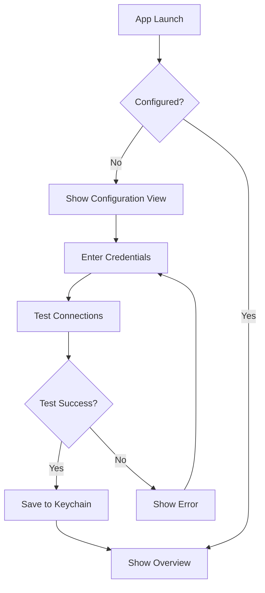
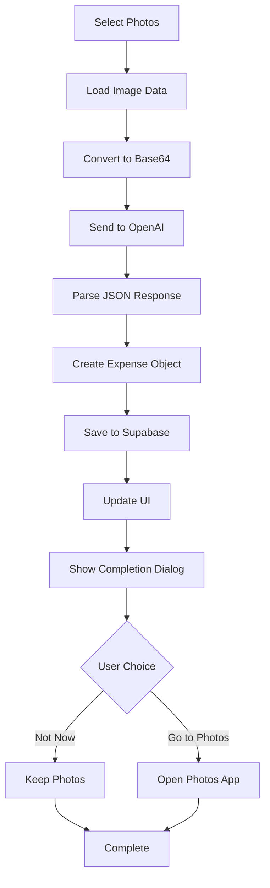
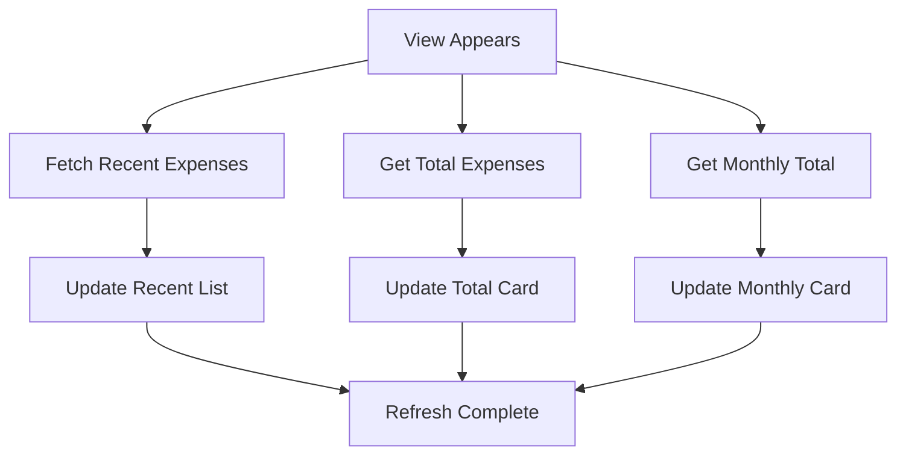

# Expense Manager iOS App - Complete Documentation

## Table of Contents
1. [Overview](#overview)
2. [Architecture](#architecture)
3. [API Integrations](#api-integrations)
4. [Database Schema](#database-schema)
5. [Data Models](#data-models)
6. [Services](#services)
7. [User Interface](#user-interface)
8. [Workflows](#workflows)
9. [Setup Instructions](#setup-instructions)
10. [Security](#security)
11. [Error Handling](#error-handling)
12. [Troubleshooting](#troubleshooting)

## Overview

The Expense Manager is an iOS application that uses AI-powered receipt scanning to automatically extract expense information and store it in a cloud database. The app combines OpenAI's Vision API for receipt processing with Supabase for data storage.

### Key Features
- **AI Receipt Processing**: Automatically extracts expense data from receipt photos
- **Secure Configuration**: Encrypted storage of API credentials using iOS Keychain
- **Cloud Storage**: Real-time data synchronization with Supabase
- **Modern UI**: SwiftUI-based interface with loading states and error handling
- **Privacy-First**: Manual photo deletion approach respecting user privacy
- **Smart Photo Management**: Post-processing dialog with options to keep or delete original photos

## Architecture

### High-Level Architecture
```
┌─────────────────┐    ┌─────────────────┐    ┌─────────────────┐
│   iOS App       │    │   OpenAI API    │    │   Supabase      │
│   (SwiftUI)     │────│   (GPT-4o)      │    │   (PostgreSQL)  │
└─────────────────┘    └─────────────────┘    └─────────────────┘
         │                       │                       │
    PhotosPicker            Vision API              REST API
    Keychain                JSON Response          Real-time DB
```

### Core Components
1. **ConfigurationManager**: API credential management and validation
2. **ExpenseService**: Main business logic coordinator
3. **OpenAIService**: Receipt processing via Vision API
4. **SupabaseService**: Database operations and sync
5. **KeychainService**: Secure credential storage

## API Integrations

### OpenAI Vision API Integration

#### Endpoint
```
POST https://api.openai.com/v1/chat/completions
```

#### Request Headers
```
Authorization: Bearer {OPENAI_API_KEY}
Content-Type: application/json
```

#### Request Body Format
```json
{
  "model": "gpt-4o",
  "messages": [
    {
      "role": "user",
      "content": [
        {
          "type": "text",
          "text": "You are an expert at extracting expense information from receipt images. Analyze the provided receipt image and extract the following information with high precision:\n\nREQUIRED FIELDS:\n1. **Date**: The transaction date (format: YYYY-MM-DD). If no date is visible, use today's date.\n2. **Merchant**: The business/store name exactly as shown on the receipt\n3. **Amount**: The total amount paid (extract only the numerical value, no currency symbol)\n4. **Currency**: The currency code (e.g., USD, EUR, GBP). Default to USD if not specified.\n5. **Category**: Choose the most appropriate category from this exact list:\n   - Food & Dining, Transportation, Shopping, Entertainment, Bills & Utilities, Healthcare, Travel, Education, Business, Other\n\nOPTIONAL FIELDS:\n6. **Description**: Brief description of items purchased (max 100 characters)\n7. **Payment Method**: Choose from: Cash, Credit Card, Debit Card, Digital Payment, Bank Transfer, Check, Other\n8. **Tax Amount**: Tax amount if clearly visible (numerical value only)\n9. **Confidence**: Your confidence level in the extraction (0.0 to 1.0)\n\nEXTRACTION RULES:\n- Look for the TOTAL or FINAL amount, not subtotals\n- Ignore tips unless they're part of the total\n- For restaurants: use \"Food & Dining\" category\n- For gas stations: use \"Transportation\" category\n- For grocery stores: use \"Food & Dining\" or \"Shopping\" based on context\n- If multiple items, categorize based on the primary expense type\n- Be conservative with confidence scores - use 0.9+ only when very certain\n\nRESPONSE FORMAT:\nReturn ONLY a valid JSON object with this exact structure (no additional text, markdown, or formatting):\n\n{\n    \"date\": \"YYYY-MM-DD\",\n    \"merchant\": \"Business Name\",\n    \"amount\": 99.99,\n    \"currency\": \"USD\",\n    \"category\": \"Food & Dining\",\n    \"description\": \"Brief description of purchase\",\n    \"paymentMethod\": \"Credit Card\",\n    \"taxAmount\": 8.25,\n    \"confidence\": 0.85\n}\n\nIf you cannot extract certain information, use null for optional fields. For required fields, make reasonable assumptions and lower the confidence score accordingly."
        },
        {
          "type": "image_url",
          "image_url": {
            "url": "data:image/jpeg;base64,{BASE64_IMAGE}"
          }
        }
      ]
    }
  ],
  "max_tokens": 500,
  "temperature": 0.1
}
```

#### Response Format
```json
{
  "choices": [
    {
      "message": {
        "content": "{JSON_EXPENSE_DATA}"
      }
    }
  ]
}
```

#### Example Real Response
```json
{
  "choices": [
    {
      "message": {
        "content": "{\n    \"date\": \"2025-07-25\",\n    \"merchant\": \"Pak Enterprises\",\n    \"amount\": 19.46,\n    \"currency\": \"EUR\",\n    \"category\": \"Shopping\",\n    \"description\": \"Anjappar Idli Rava, Fresh Chillies, TRS Urid Whole Gota\",\n    \"paymentMethod\": \"Debit Card\",\n    \"taxAmount\": 1.27,\n    \"confidence\": 0.95\n}"
      }
    }
  ]
}
```

#### Extracted Expense Data Format
After parsing the OpenAI response, the app extracts this structured data:
```json
{
  "date": "2025-07-25",
  "merchant": "Pak Enterprises",
  "amount": 19.46,
  "currency": "EUR",
  "category": "Shopping",
  "description": "Anjappar Idli Rava, Fresh Chillies, TRS Urid Whole Gota",
  "paymentMethod": "Debit Card",
  "taxAmount": 1.27,
  "confidence": 0.95
}
```

#### Processing Steps
1. **Image Compression**: Receipt photo compressed to 80% JPEG quality
2. **Base64 Encoding**: Image converted to base64 string for API transmission
3. **Request Construction**: Structured prompt + image data sent to GPT-4o
4. **Response Parsing**: JSON extracted from response, markdown cleaned if present
5. **Data Validation**: Extracted fields validated and transformed to app models
6. **Error Handling**: Comprehensive error catching for network, parsing, and validation issues

### Supabase REST API Integration

#### Base URL
```
https://{PROJECT_ID}.supabase.co/rest/v1
```

#### Request Headers
```
Authorization: Bearer {SUPABASE_ANON_KEY}
apikey: {SUPABASE_ANON_KEY}
Content-Type: application/json
Prefer: return=representation
```

#### Create Expense
```http
POST https://{PROJECT_ID}.supabase.co/rest/v1/expenses
Authorization: Bearer {SUPABASE_ANON_KEY}
apikey: {SUPABASE_ANON_KEY}
Content-Type: application/json
Prefer: return=representation

{
  "id": "123e4567-e89b-12d3-a456-426614174000",
  "date": "2025-07-25T10:00:00Z",
  "merchant": "Pak Enterprises",
  "amount": 19.46,
  "currency": "EUR",
  "category": "Shopping",
  "description": "Anjappar Idli Rava, Fresh Chillies, TRS Urid Whole Gota",
  "payment_method": "Debit Card",
  "tax_amount": 1.27,
  "receipt_image_url": null,
  "created_at": "2025-07-25T10:00:00Z",
  "updated_at": "2025-07-25T10:00:00Z"
}
```

**Response (201 Created):**
```json
[
  {
    "id": "123e4567-e89b-12d3-a456-426614174000",
    "date": "2025-07-25T10:00:00+00:00",
    "merchant": "Pak Enterprises",
    "amount": 19.46,
    "currency": "EUR",
    "category": "Shopping",
    "description": "Anjappar Idli Rava, Fresh Chillies, TRS Urid Whole Gota",
    "payment_method": "Debit Card",
    "tax_amount": 1.27,
    "receipt_image_url": null,
    "created_at": "2025-07-25T10:00:00.123456+00:00",
    "updated_at": "2025-07-25T10:00:00.123456+00:00"
  }
]
```

#### Fetch Recent Expenses
```http
GET https://{PROJECT_ID}.supabase.co/rest/v1/expenses?order=created_at.desc&limit=10
Authorization: Bearer {SUPABASE_ANON_KEY}
apikey: {SUPABASE_ANON_KEY}
Content-Type: application/json
```

**Response (200 OK):**
```json
[
  {
    "id": "123e4567-e89b-12d3-a456-426614174000",
    "date": "2025-07-25T10:00:00+00:00",
    "merchant": "Pak Enterprises",
    "amount": 19.46,
    "currency": "EUR",
    "category": "Shopping",
    "description": "Anjappar Idli Rava, Fresh Chillies, TRS Urid Whole Gota",
    "payment_method": "Debit Card",
    "tax_amount": 1.27,
    "receipt_image_url": null,
    "created_at": "2025-07-25T10:00:00.123456+00:00",
    "updated_at": "2025-07-25T10:00:00.123456+00:00"
  }
]
```

#### Get Total Expenses
```http
GET https://{PROJECT_ID}.supabase.co/rest/v1/expenses?select=amount
Authorization: Bearer {SUPABASE_ANON_KEY}
apikey: {SUPABASE_ANON_KEY}
Content-Type: application/json
```

**Response (200 OK):**
```json
[
  {"amount": 19.46},
  {"amount": 25.99},
  {"amount": 12.50}
]
```

#### Get Monthly Total
```http
GET https://{PROJECT_ID}.supabase.co/rest/v1/expenses?select=amount&date=gte.2025-07-01T00:00:00Z&date=lt.2025-08-01T00:00:00Z
Authorization: Bearer {SUPABASE_ANON_KEY}
apikey: {SUPABASE_ANON_KEY}
Content-Type: application/json
```

**Response (200 OK):**
```json
[
  {"amount": 19.46},
  {"amount": 25.99}
]
```

#### Connection Test
```http
GET https://{PROJECT_ID}.supabase.co/rest/v1/
Authorization: Bearer {SUPABASE_ANON_KEY}
apikey: {SUPABASE_ANON_KEY}
Content-Type: application/json
```

**Response (200 OK or 404 Not Found - both indicate valid connection):**
```json
{
  "message": "ok"
}
```

## Database Schema

### Expenses Table
```sql
CREATE TABLE expenses (
    id UUID PRIMARY KEY DEFAULT gen_random_uuid(),
    date TIMESTAMP WITH TIME ZONE NOT NULL,
    merchant TEXT NOT NULL,
    amount DECIMAL(10,2) NOT NULL,
    currency TEXT NOT NULL DEFAULT 'USD',
    category TEXT NOT NULL,
    description TEXT,
    payment_method TEXT,
    tax_amount DECIMAL(10,2),
    receipt_image_url TEXT,
    created_at TIMESTAMP WITH TIME ZONE DEFAULT NOW(),
    updated_at TIMESTAMP WITH TIME ZONE DEFAULT NOW()
);
```

### Reference Tables
```sql
-- Categories
CREATE TABLE expense_categories (
    id SERIAL PRIMARY KEY,
    name TEXT UNIQUE NOT NULL,
    icon TEXT,
    color TEXT,
    created_at TIMESTAMP WITH TIME ZONE DEFAULT NOW()
);

-- Payment Methods
CREATE TABLE payment_methods (
    id SERIAL PRIMARY KEY,
    name TEXT UNIQUE NOT NULL,
    icon TEXT,
    created_at TIMESTAMP WITH TIME ZONE DEFAULT NOW()
);
```

### Indexes
```sql
CREATE INDEX idx_expenses_date ON expenses(date);
CREATE INDEX idx_expenses_category ON expenses(category);
CREATE INDEX idx_expenses_merchant ON expenses(merchant);
CREATE INDEX idx_expenses_created_at ON expenses(created_at);
```

### Row Level Security
```sql
ALTER TABLE expenses ENABLE ROW LEVEL SECURITY;

CREATE POLICY "Allow all operations on expenses" ON expenses
    FOR ALL USING (true) WITH CHECK (true);
```

## Data Models

### Swift Data Models

#### Core Expense Model
```swift
struct Expense: Identifiable, Codable {
    let id: UUID
    let date: Date
    let merchant: String
    let amount: Double
    let currency: String
    let category: String
    let description: String?
    let paymentMethod: String?
    let taxAmount: Double?
    let receiptImageUrl: String?
    let createdAt: Date
    let updatedAt: Date
}
```

#### OpenAI Response Models
```swift
struct OpenAIExpenseExtraction: Codable {
    let date: String
    let merchant: String
    let amount: Double
    let currency: String
    let category: String
    let description: String?
    let paymentMethod: String?
    let taxAmount: Double?
    let confidence: Double
}

struct OpenAIResponse: Codable {
    let choices: [Choice]
    
    struct Choice: Codable {
        let message: Message
    }
    
    struct Message: Codable {
        let content: String
    }
}
```

#### Supabase Models
```swift
struct SupabaseExpense: Codable {
    let id: UUID?
    let date: String
    let merchant: String
    let amount: Double
    let currency: String
    let category: String
    let description: String?
    let payment_method: String?
    let tax_amount: Double?
    let receipt_image_url: String?
    let created_at: String?
    let updated_at: String?
}

struct SupabaseAmountOnly: Codable {
    let amount: Double
}
```

## Services

### KeychainService
Manages secure storage of API credentials using iOS Keychain.

#### Methods
```swift
func save(_ value: String, for key: KeychainKey) -> Bool
func retrieve(for key: KeychainKey) -> String?
func delete(for key: KeychainKey) -> Bool
func deleteAll() -> Bool
```

#### Keychain Keys
```swift
enum KeychainKey: String {
    case supabaseUrl = "supabase_url"
    case supabaseKey = "supabase_key"
    case openaiKey = "openai_key"
}
```

### ConfigurationManager
Handles API credential validation and connection testing.

#### Key Methods
```swift
func saveConfiguration(supabaseUrl: String, supabaseKey: String, openaiKey: String) async -> Bool
func testConnections() async
private func testSupabaseConnection() async -> (success: Bool, error: String?)
private func testOpenAIConnection() async -> (success: Bool, error: String?)
```

#### Connection Test Logic
1. **Supabase Test**: GET request to `/rest/v1/` endpoint
2. **OpenAI Test**: GET request to `/v1/models` endpoint
3. **Status Codes**: 200/404 = success, 401 = invalid key, others = error

### OpenAIService
Processes receipt images using GPT-4o Vision API.

#### Key Methods
```swift
func extractExpenseFromReceipt(_ image: UIImage) async throws -> OpenAIExpenseExtraction
private func createExpenseExtractionPrompt() -> String
private func parseExpenseExtraction(from content: String) throws -> OpenAIExpenseExtraction
```

#### Processing Steps
1. Convert UIImage to JPEG data (80% quality)
2. Encode image as Base64 string
3. Create structured prompt for expense extraction
4. Send request to OpenAI API
5. Parse JSON response and validate data
6. Clean markdown formatting if present

### SupabaseService
Manages all database operations with Supabase.

#### Key Methods
```swift
func createExpense(_ expense: Expense) async throws -> Expense
func fetchExpenses(limit: Int?, offset: Int?) async throws -> [Expense]
func getTotalExpenses() async throws -> Double
func getMonthlyTotal() async throws -> Double
```

#### Request Headers
```swift
private var headers: [String: String] {
    return [
        "Authorization": "Bearer \(apiKey)",
        "apikey": apiKey,
        "Content-Type": "application/json",
        "Prefer": "return=representation"
    ]
}
```

### ExpenseService
Main service coordinator that orchestrates the complete workflow.

#### Key Methods
```swift
func processReceiptPhotos(_ photoItems: [PhotosPickerItem]) async -> Int
func fetchRecentExpenses(limit: Int = 10) async throws -> [Expense]
func getTotalExpenses() async throws -> Double
func getMonthlyTotal() async throws -> Double
```

#### Processing Completion Dialog
After successful photo processing, the app displays a completion dialog with options:
- **Not Now**: Keeps original photos in the user's library
- **Go to Photos**: Opens the Photos app for manual deletion

#### Published Properties
```swift
@Published var showProcessingCompletionDialog = false
@Published var processedPhotoCount = 0
```

## User Interface

### View Structure
```
ExpenseManagerApp
├── ConfigurationView (First launch setup)
└── OverviewView (Main interface)
    ├── Summary Cards (Monthly/Total)
    ├── Receipt Processing Section
    ├── Processed Photos Section
    └── Recent Expenses Section
```

### Key UI Components

#### ConfigurationView
- **Purpose**: First-time setup and credential management
- **Fields**: Supabase URL, Supabase Key, OpenAI Key
- **Features**: Connection testing, validation, secure storage

#### OverviewView
- **Purpose**: Main app interface
- **Sections**: 
  - Summary cards with totals
  - PhotosPicker for receipt selection
  - Processed photos tracking
  - Recent expenses list
- **Dialogs**: 
  - Processing completion dialog with photo management options
  - "Not Now" and "Go to Photos" buttons for user choice

#### Summary Cards
```swift
struct SummaryCard: View {
    let title: String
    let amount: Double
    let icon: String
    let color: Color
}
```

#### Expense Row
```swift
struct ExpenseRowView: View {
    let expense: Expense
    // Displays: merchant, category, date, amount, payment method
}
```

## Workflows

### 1. Initial Setup Workflow


### 2. Receipt Processing Workflow


### 3. Data Loading Workflow


## Setup Instructions

### Prerequisites
- iOS 17.0+
- Xcode 15.0+
- Supabase account and project
- OpenAI API account with GPT-4o access

### 1. Database Setup
1. Create new Supabase project
2. Run the SQL schema from `supabase_schema.sql`
3. Configure Row Level Security policies
4. Note your project URL and anon key

### 2. OpenAI Setup
1. Create OpenAI account
2. Generate API key with GPT-4o access
3. Ensure sufficient credits/quota

### 3. App Configuration
1. Open project in Xcode
2. Build and run the app
3. On first launch, enter:
   - **Supabase URL**: `https://xxx.supabase.co`
   - **Supabase Anon Key**: Your public anon key
   - **OpenAI API Key**: Your OpenAI API key
4. Test connections to verify setup

### 4. Info.plist Requirements
```xml
<key>NSPhotoLibraryUsageDescription</key>
<string>This app needs access to your photo library to delete processed receipt photos after successful expense tracking.</string>
```

## Security

### Credential Storage
- **Keychain**: All API credentials stored in iOS Keychain
- **Encryption**: Keychain provides hardware-backed encryption
- **Access**: Credentials only accessible to the app
- **Deletion**: Secure deletion when credentials are removed

### API Security
- **HTTPS Only**: All API communications use TLS
- **Bearer Tokens**: OpenAI uses Bearer authentication
- **Row Level Security**: Supabase RLS enabled for data protection
- **No Logging**: Sensitive data never logged in production

### Privacy
- **Photo Access**: Minimal permissions, no permanent photo storage
- **Manual Deletion**: User controls photo deletion
- **Local Processing**: Images processed locally before API calls

## Error Handling

### OpenAI Errors
```swift
enum OpenAIError: LocalizedError {
    case missingAPIKey
    case invalidAPIKey
    case apiError(Int)
    case responseParsingFailed
    case imageProcessingFailed
    case noResponseContent
    case requestEncodingFailed
    case invalidResponse
}
```

### Supabase Errors
```swift
enum SupabaseError: LocalizedError {
    case missingCredentials
    case unauthorized
    case invalidURL
    case encodingFailed
    case decodingFailed
    case invalidResponse
    case notFound
    case clientError(Int)
    case serverError(Int)
    case unknownError(Int)
    case noDataReturned
}
```

### Error Recovery Strategies
1. **Network Errors**: Retry with exponential backoff
2. **Authentication**: Prompt for credential re-entry
3. **Parsing Errors**: Log details and show user-friendly message
4. **Rate Limits**: Inform user and suggest retry later

## Troubleshooting

### Common Issues

#### 1. Connection Test Failures
**Symptoms**: "Invalid API key" or "Connection failed"
**Solutions**:
- Verify API credentials are correct
- Check internet connectivity
- Ensure Supabase project is active
- Verify OpenAI account has credits

#### 2. Receipt Processing Errors
**Symptoms**: "Failed to process receipts"
**Solutions**:
- Verify OpenAI API key has Vision model access
- Ensure images are clear and readable
- Check API usage limits and quotas
- Try with different receipt images

#### 3. Database Errors
**Symptoms**: "Database error" or "Failed to load expenses"
**Solutions**:
- Verify Supabase schema is properly set up
- Check Row Level Security policies
- Ensure API key has necessary permissions
- Verify database connection

#### 4. Photo Selection Issues
**Symptoms**: Photos not loading or processing
**Solutions**:
- Grant photo library permissions
- Ensure photos are downloaded locally (not in iCloud)
- Try with different photo formats
- Check device storage space

### Debug Logging
The app includes comprehensive logging for troubleshooting:
- OpenAI request/response logging
- Supabase query logging
- Photo processing status
- Error details with context

### Performance Considerations
- **Image Compression**: Photos compressed to 80% JPEG quality
- **Batch Processing**: Multiple photos processed sequentially
- **Memory Management**: Images released after processing
- **Network Optimization**: Minimal data transfer with selected fields

---

## API Rate Limits and Costs

### OpenAI API
- **Model**: GPT-4o (Vision)
- **Cost**: ~$0.01-0.03 per receipt
- **Rate Limits**: Varies by account tier
- **Optimization**: Single request per receipt

### Supabase
- **Free Tier**: 500MB database, 2GB bandwidth
- **Pricing**: Pay-as-you-scale
- **Optimization**: Efficient queries with selected fields

This documentation provides a complete reference for understanding, maintaining, and extending the Expense Manager iOS application.